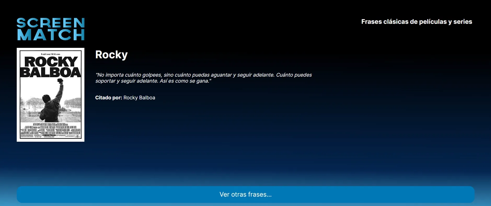

# Screematch Frases Aleatorias


Este proyecto es una aplicación web desarrollada con Spring Boot que muestra frases clásicas aleatorias de películas y series. La aplicación expone una API que permite obtener una frase aleatoria cada vez que se accede a un endpoint específico.

## Tecnologías utilizadas
* Java
* Spring Boot
* JPA (Java Persistence API)
* H2 Database (para pruebas y desarrollo)
* Maven
## Funcionalidades
* Obtener una frase aleatoria de películas y series.
* La frase incluye el texto de la frase, el personaje que la dijo, el título de la serie o película, y un enlace al poster correspondiente.
## Estructura del Proyecto
El proyecto está organizado en los siguientes paquetes:

* com.aluracursos.screematch_frases: Contiene la clase principal para arrancar la aplicación.
* com.aluracursos.screematch_frases.repository: Contiene la interfaz del repositorio para acceder a los datos de las frases.
* com.aluracursos.screematch_frases.model: Contiene la clase Frase que representa el modelo de datos.
* com.aluracursos.screematch_frases.dto: Contiene la clase FraseDTO que se utiliza para transferir datos.
* com.aluracursos.screematch_frases.controller: Contiene el controlador que maneja las solicitudes HTTP.
* com.aluracursos.screematch_frases.config: Contiene la configuración de CORS.
## Ejemplos de Código
### Clase Principal
```java
package com.aluracursos.screematch_frases;

import org.springframework.boot.SpringApplication;
import org.springframework.boot.autoconfigure.SpringBootApplication;

@SpringBootApplication
public class ScreematchFrasesApplication {

    public static void main(String[] args) {
        SpringApplication.run(ScreematchFrasesApplication.class, args);
    }

}
```
### Repositorio
```java
package com.aluracursos.screematch_frases.repository;

import com.aluracursos.screematch_frases.model.Frase;
import org.springframework.data.jpa.repository.JpaRepository;
import org.springframework.data.jpa.repository.Query;

public interface FraseRepository extends JpaRepository<Frase, Long> {

    @Query("SELECT f FROM Frase f ORDER BY function('RANDOM') LIMIT 1")
    public Frase obtenerFraseAleatoria();
}
```
### Modelo
```java
package com.aluracursos.screematch_frases.model;

import jakarta.persistence.*;

@Entity
@Table(name = "frases")
public class Frase {
@Id
@GeneratedValue(strategy = GenerationType.IDENTITY)
private Long id;
private String frase;
private String personaje;
private String titulo;
private String poster;

    // Getters y Setters
}
```
### DTO
```java
package com.aluracursos.screematch_frases.dto;

public record FraseDTO(String frase, String personaje, String titulo, String poster) {
}
```
### Controlador
```java
package com.aluracursos.screematch_frases.controller;

import com.aluracursos.screematch_frases.dto.FraseDTO;
import com.aluracursos.screematch_frases.service.FraseService;
import org.springframework.beans.factory.annotation.Autowired;
import org.springframework.web.bind.annotation.GetMapping;
import org.springframework.web.bind.annotation.RestController;

@RestController
public class FrasesController {
@Autowired
FraseService servicio;

    @GetMapping("/series/frases")
    public FraseDTO obtenerFraseAleatoria() {
        return servicio.obtenerFraseAleatoria();
    }
}
```
### Configuración de CORS
```java
package com.aluracursos.screematch_frases.config;

import org.springframework.context.annotation.Configuration;
import org.springframework.web.servlet.config.annotation.CorsRegistry;
import org.springframework.web.servlet.config.annotation.WebMvcConfigurer;

@Configuration
public class CorsConfiguration implements WebMvcConfigurer {
@Override
public void addCorsMappings(CorsRegistry registry) {
registry.addMapping("/**")
.allowedOrigins("http://127.0.0.1:5500")
.allowedMethods("GET", "POST", "DELETE", "OPTIONS", "HEAD", "TRACE", "CONNECT");
}
}
```
## Instrucciones para ejecutar el proyecto
1. Clona este repositorio.
2. Navega hasta la carpeta del proyecto.
3. Ejecuta el comando mvn spring-boot:run para iniciar la aplicación.
4. Accede a http://localhost:8080/series/frases para obtener una frase aleatoria.

## Contribución
Si deseas contribuir a este proyecto, ¡eres bienvenido! Puedes enviar pull requests con mejoras o correcciones.

## Agradecimientos
Agradezco al **Programa ONE** de [Alura Latam](https://www.linkedin.com/company/alura-latam/) y [Oracle](https://www.linkedin.com/company/oracle/) por proporcionar el material y el contexto para desarrollar este proyecto.

## Autor
Este proyecto fue creado por [Fica](https://github.com/Fica-Millan).

¡Siéntete libre de contactarme si tienes alguna pregunta o sugerencia!

[LinkedIn](https://www.linkedin.com/in/yesica-fica-millan/)
